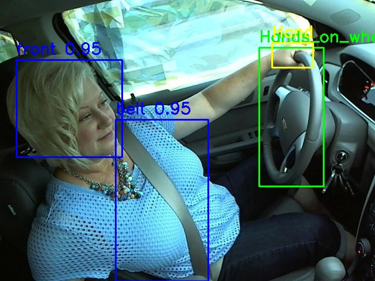

# **In-Vehicle Object Detection System**  
**YOLOv8 + MediaPipe for Driver Monitoring**  

---

## **Table of Contents**  
- [Project Overview](#-project-overview)  
- [Key Features](#-key-features)  
- [Dataset](#-dataset)  
- [Model Training & Performance](#-model-training--performance)  
- [Installation](#-installation)  
- [Usage](#-usage)  
- [Repository Structure](#-repository-structure)  
- [Results & Visualizations](#-results--visualizations)  


---

## **Project Overview**  
This project combines **YOLOv8** (for object detection) and **MediaPipe** (for hand tracking) to:  
Detect **steering wheels** and classify **hands-on vs. hands-off** scenarios  
Identify **7 key classes** in vehicle cabins (`belt`, `cup`, `front`, `left`, `phone`, `right`, `wheel`)  
Optimize hand detection using **ROI (Region of Interest)** around the steering wheel  

**Use Cases:**  
- **Driver Monitoring Systems (DMS)**  
- **Distracted driving detection**  
- **Autonomous vehicle safety checks**  

---

## **Key Features**  
| **Feature** | **Description** |
|------------|----------------|
| **Multi-Class Detection** | YOLOv8 detects 7 classes with high precision |
| **Hand-Wheel Interaction** | Uses **IoU (Intersection over Union)** to determine if hands are on/off the wheel |
| **ROI Optimization** | MediaPipe hand detection focuses only around the steering wheel for efficiency |
| **Visual Annotations** | Outputs labeled images with bounding boxes and interaction status |
| **High mAP Scores** | Achieves **>96% mAP50** for `wheel` and `cup` detection |

---

## **Dataset**  
- **Source:** Combined from **Roboflow** (2 datasets merged)  
- **Classes:** `belt`, `cup`, `front`, `left`, `phone`, `right`, `wheel`  
- **Format:** YOLOv8-compatible (images + labels in `.txt` files)  
- **Splits:**  
  - **Train:** `train/`  
  - **Validation:** `valid/`  
  - **Test:** `test/`  

**Dataset Config (`in_vehicle_objects.yaml`):**  
```yaml
path: /in_vehicle_objects_dataset
train: train/images
val: valid/images
test: test/images
nc: 7
names: ['belt', 'cup', 'front', 'left', 'phone', 'right', 'wheel']
```

---

## **Model Training & Performance**  
### **Training Details**  
- **Model:** `YOLOv11x` (Ultralytics YOLOv8 variant)  
- **Epochs:** 200 (~3.9 hours on **NVIDIA RTX 3090**)  
- **Image Size:** `640x640`  
- **Batch Size:** `16` (CUDA) / `8` (CPU)  
- **Optimizer:** SGD (`lr=0.01`, `momentum=0.937`)  
- **Augmentations:** Mosaic, MixUp, HSV, flips, etc.  

### **Validation Metrics**  
| **Class** | **Precision** | **Recall** | **mAP50** | **mAP50-95** |
|-----------|--------------|-----------|-----------|--------------|
| **wheel** | 0.998 | 1.000 | 0.995 | 0.969 |
| **cup** | 0.978 | 1.000 | 0.995 | 0.970 |
| **belt** | 0.880 | 0.958 | 0.970 | 0.837 |
| **front** | 0.954 | 0.992 | 0.987 | 0.901 |
| **right** | 0.928 | 0.978 | 0.983 | 0.863 |
| **left** | 0.947 | 0.429 | 0.595 | 0.450 |
| **phone** | 1.000 | 0.280 | 0.516 | 0.292 |

**Best Model Weights:**  
`models/exp_20250419_0242442/weights/best.pt`  

---
 
## **Installation**  
1. **Clone the repo:**  
   ```bash
   git clone https://github.com/ghaidaasamir/In-Vehicle-Object-Detection.git
   cd In-Vehicle-Object-Detection
   ```

2. **Install dependencies:**  
   ```bash
   pip install ultralytics mediapipe opencv-python tqdm numpy
   ```

3. **Use trained weights** (or train your own model). [best weight](https://drive.google.com/file/d/1TlNbHDsRRoy-9wEmSIcpeTknGGpHVfTA/view?usp=sharing)

---

## **Usage**  
### **1. Run Inference (Detect Hands on Wheel)**  
```bash
python scripts/inference/optimized_hand_wheel_detector.py
```
**Output:**  
- Annotated images in `outputs/`  
- IoU scores for hand-wheel interaction  

### **2. Train the Model**  
```bash
python scripts/training/train_vehicle_objects.py
```
**Logs & Weights:** Saved in `models/exp_YYYYMMDD_HHMMSS/`  

---

## **Repository Structure**  
```
In-Vehicle-Object-Detection/
├── configs/                     # YOLO config file
├── datasets/                    # Combined dataset (train/valid/test)
├── models/                      # Trained weights & training logs
├── outputs/                     # Inference results
├── scripts/
│   ├── inference/               # Detection scripts
│   └── training/                # Training script
└── README.md                    
```

---

## **Results & Visualizations**  
### **Training Insights**  
- **Precision-Recall Curve (`PR_curve.png`)**  
- **F1 Score Curve (`F1_curve.png`)**  
- **Confusion Matrix (`confusion_matrix.png`)**  
- **Batch Examples (`train_batch*.jpg`)**  

**Sample Output:**  
  

---
